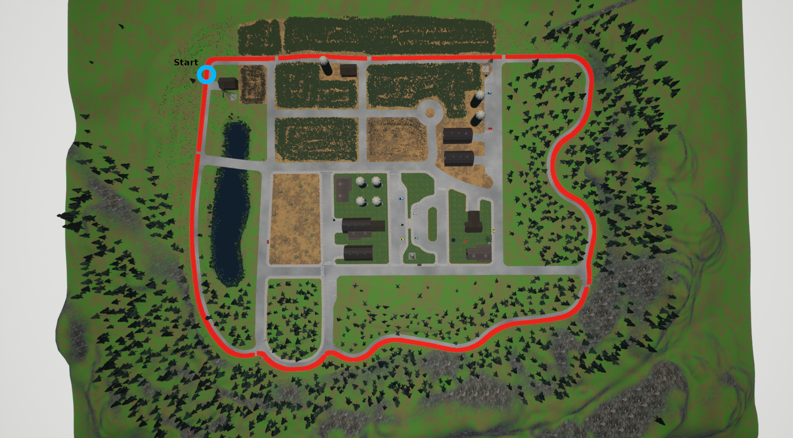
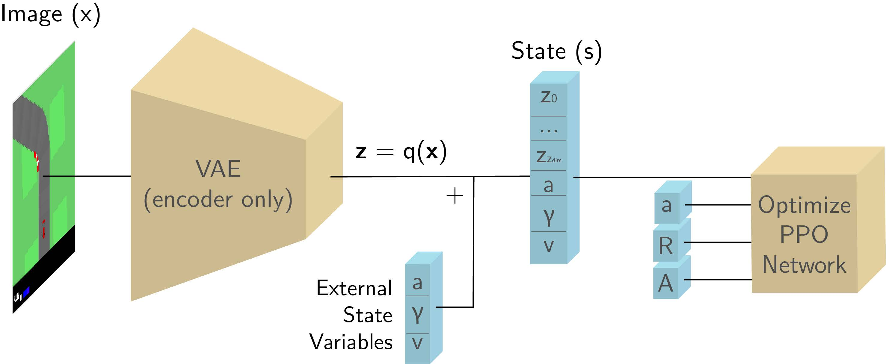
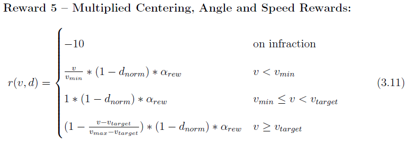

# CARLA PPO agent

<!---THIS DOCUMENT IS A WORK-IN-PROGRESS--->

## About the Project
This project concerns how we may design environments in order to facilitate the training of
deep reinforcement learning based autonomous driving agents. The goal of the project is to
provide a working deep reinforcement learning framework that can learn to drive in visually
complex environments, with a focus on providing a solution that:

1. Works out-of-the-box.
2. Learns in a short time to make it easier to quickly iterate on and test hypotheses.
3. Provide tailored metrics to compare agents between runs.

We have used the urban driving simulator [CALRA](http://carla.org/) (version 0.9.5) as our environment.

Find a detailed project write-up [here](doc/Accelerating_Training_of_DeepRL_Based_AV_Agents_Through_Env_Designs.pdf).

Video of results:

<p align="center">
  <a href="http://www.youtube.com/watch?feature=player_embedded&v=iF502iJKTIY" target="_blank">
    
  </a>
</p>

Use the timestamps in the description to navigate to the experiments of your interest.

## Contributions

<p align="center">
  
</p>
<p align="center">
  Figure 1: Town07 lap
</p>

- We provide two gym-like environments for CARLA*:
    1. Lap environment: This environment is focused on training an agent to follow a predetermined lap (see [CarlaEnv/carla_lap_env.py](CarlaEnv/carla_lap_env.py))
    2. Route environment: This environment is focused on training agents that can navigate from point A to point B (see [CarlaEnv/carla_route_env.py](CarlaEnv/carla_route_env.py).
- We provide analysis of optimal PPO parameters, environment designs, reward functions, etc. with the aim of finding the optimal setup to train reinforcement learning based autonomous driving agents (see Chapter 4 of [the project write-up](doc/Accelerating_Training_of_DeepRL_Based_AV_Agents_Through_Env_Designs.pdf) for further details.)
- We have shown that how we train and use a VAE can be consequential to the performance of a deep reinforcement learning agent, and we have found that major improvements can be made by training the VAE to reconstruct semantic segmentation maps instead of reconstructing the RGB input itself.
- We have devised a model that can reliably solve the lap environment in ~8 hours on average on a Nvidia GTX 970.
- We have provided an example of how sub-policies can be used to navigate with PPO, and we found it to have moderate success in the route environment (See the [sub-policy branch](https://github.com/bitsauce/Carla-ppo/tree/sub-policy)).

\* While there are existing examples of gym-like environments for CARLA, there is no implementation that is officially endorsed by CARLA. Furthermore, most of the third-party environments do not provide an example of an agent that works out-of-the-box.

## Related Work

1. [Learning to Drive in a Day](https://arxiv.org/abs/1807.00412) by Kendall _et. al._
This paper by researchers at Wayve describes a method that showed how state representation learning through a variational autoencoder can be used to train a car to follow a straight country road in approximately 15 minutes.
2. [Learning to Drive Smoothly in Minutes](https://towardsdatascience.com/learning-to-drive-smoothly-in-minutes-450a7cdb35f4) by Raffin _et. al._ This medium article lays out the details of a method that was able to train an agent in a Donkey Car simulator in only 5 minutes, using a similar approach as (1). They further provide some solutions to the unstable steering we may observe when we train with the straight forward speed-as-reward reward formulation of Kendall.
3. [End-to-end Driving via Conditional Imitation Learning](https://arxiv.org/abs/1710.02410) by Codevilla _et. al._ This paper outlines an imitation learning model that is able to learn to navigate arbitrary routes by using multiple actor networks, conditioned on what the current maneuver the vehicle should take is. We have used a similar approach in our route environment agent.

# Method Overview

This is a high-level overview of the method.

1. Collect 10k 160x80x3 images by driving around manually.
2. Train a VAE to reconstruct the images.
3. Train an agent using the encoded state representations generated by the trained VAE and append a vector of measurements (steering, throttle, speed.) This is the input of the PPO-based agent.

<p align="center">
  
</p>
<p align="center">
  Figure 2:
</p>

# How to Run

## Prerequisites

- Python 3.6
- [CARLA 0.9.5](https://github.com/carla-simulator/carla/tree/0.9.5) (may also work with later versions)
    - Our code expects the CARLA python API to be installed and available through `import carla` (see [this](https://carla.readthedocs.io/en/latest/build_system/#pythonapi))
    - We also recommend building a editor-less version of Carla by running the `make package` command in the root directory of CARLA.
    - Note that the map we use, `Town07`, may not be included by default when running `make package`. Add `+MapsToCook=(FilePath="/Game/Carla/Maps/Town07")` to `Unreal/CarlaUE4/Config/DefaultGame.ini` before running `make package` to solve this.
- [TensorFlow for GPU](https://www.tensorflow.org/) (we have used version 1.13, may work with later versions)
- [OpenAI gym](https://github.com/openai/gym) (we used version 0.12.0)
- [OpenCV for Python](https://pypi.org/project/opencv-python/) (we used version 4.0.0)
- A GPU with at least 4 GB VRAM (we used a GeForce GTX 970)

## Running a Trained Agent

With the project, we provide a pretrained PPO agent for the lap environment.
The checkpoint file for this model is located in the `models` folder.

The easiest way to get this model run, is to first set an environment variable named
`${CARLA_ROOT}` to point to the top-level directory in your CARLA installation.

Afterward, we can simply call:

```
python run_eval.py --model_name pretrained_agent -start_carla
```

And CARLA should automatically be started and our agent driving.
This particular agent should be able to drive about 850m along the designated lap
(Figure 1).

Note that our environment has only been designed to work with `Town07` since this map is the one that closest
resembles the environments of Kendall _et. al._ and Raffin _et. al._.
<!---(see TODO for more information on environment design.)--->

## Training a New Agent

Set `${CARLA_ROOT}` as is described in [Running a Trained Agent](#running-a-trained-agent).

Then use the following command to train a new agent:

```
python train.py --model_name name_of_your_model -start_carla
```

This will start training an agent with the default parameters,
and checkpoint and log files will be written to `models/name_of_your_model`.

Recording of the evaluation episodes will also be written to
`models/name_of_your_model/videos` by default,
making it easier to evaluate an agent's behavior over time.

To view the training progress of an agent, and to compare
trained agents in TensorBoard, use the following command:

```
tensorboard --logdir models/
```

## Training the Variational Autoencoder

If you wish to collect data to train the variational autoencoder yourself,
you may use the following command:

```
python CarlaEnv/collect_data.py --output_dir vae/my_data -start_carla
```

Press SPACE to begin recording frames. 10K images will be saved by default.

After you have collected data to train the VAE with, use the following command to train the VAE:

```
cd vae
python train_vae.py --model_name my_trained_vae --dataset my_data
```

To view the training progress and to compare trained VAEs in TensorBoard, use the following command:

```
cd vae
tensorboard --logdir models/
```

## Inspecting VAE Reconstructions

Once we have a trained VAE, we can use the following command to inspect how its reconstructions look:

```
cd vae
python inspect_vae.py --model_dir models/my_trained_vae
```

Use the `Set z by image` button to seed your VAE with the latent z that is generated when the image
selected is passed through the encoder (useful for comparing VAE reconstructions across models,
as there is no guarantee that the features of the input will be encoded in the same indices of Z.)

## Inspecting the Agent's Decision Making

We may also use the following command to see how a trained agent will behave to changes in latent space vector z by running:

```
python inspect_agent.py --model_name name_of_your_model
```

# File Overview

| File                         | Description                                                                                                                     |
| ---------------------------- | ------------------------------------------------------------------------------------------------------------------------------- |
| train.py                     | Script for training a PPO agent in the lap environment                                                                          |
| run_eval.py                  | Script for running a trained model in eval mode                                                                                 |
| utils.py                     | Contains various mathematical, tensorflow, DRL utility functions                                                                |
| ppo.py                       | Contains code for constructing the PPO model                                                                                    |
| reward_functions.py          | Contains all reward functions                                                                                                   |
| vae_common.py                | Contains functions related to VAE loading and state encoding                                                                    |
| inspect_agent.py             | Script used to inspect the behavior of the agent as the VAE's latent space vector z is annealed                                 |
| models/                      | Folder containing agent checkpoints, tensorboard log files, and video recordings                                                |
| doc/                         | Folder containing figures that are used in this readme, in addition to a PDF version of the project write-up                    |
| vae/                         | Folder containing variational autoencoder related code                                                                          |
| vae/train_vae.py             | Script for training a variational autoencoder                                                                                   |
| vae/models.py                | Contains code for constructing MLP and CNN-based VAE models                                                                     |
| vae/inspect_vae.py           | Script used to inspect how latent space vector z affects the reconstructions of a trained VAE                                   |
| vae/data/                    | Folder containing the images that were used when training the VAE model bundled with the repo                                   |
| vae/models/                  | Folder containing VAE model checkpoints and tensorboard logs                                                                    |
| CarlaEnv/                    | Folder containing code related to the CARLA environments                                                                        |
| CarlaEnv/carla_lap_env.py    | Contains code for the CarlaLapEnv class                                                                                         |
| CarlaEnv/carla_route_env.py  | Contains code for the CarlaRouteEnv class                                                                                       |
| CarlaEnv/collect_data.py     | Script used to manually drive a car in the environment to collect images that can be used to train a VAE                        |
| CarlaEnv/hud.py              | Code for the HUD displayed on the left-hand side of the spectating window                                                       |
| CarlaEnv/planner.py          | Global route planner used to find routes from A to B. Copied and modified from CARLA 0.9.4's PythonAPI                          |
| CarlaEnv/wrappers.py         | Contains wrapper classes for several CARLA classes                                                                              |
| CarlaEnv/agents/             | Contains code used by the route planner                                                                                         |

<!--- 
# Summary of Environment and Agent Design

Here we have summarized the main findings and reasoning behind various design decisions.

## Reward functions

<p align="center">
  
</p>

In our experiments, we have found that the reward function to give the best results
in terms of creating agents that drive in the center of the lane, and at a constant
target speed of 20 kmh, was reward 5.

## Fail Faster Through Checkpoints

One thing that we quickly observed when we tried to train an agent in the lap environment,
was that the agent's learning stagnated after approximately 3 hours. Beyond the 3 hour mark,
the agent would spend about 2 minutes driving a well-known path until it would hit a particularly
difficult turn and would immediately fail.

In order to overcome this obstacle, the agent needs to either
(1) repeatedly attempt this stretch of road, and, by the help of lucky values
sampled from exploration noise, sample actions that lead to better rewards, or
(2) experience similar stretches of roads to eventually generalize to this road as well.

Since the agent did not learn even after 20 hours, we concluded that the repeated
stretch of the lap does not aid the agent in generalizing (2). That meant that the
only way the agent will overcome the obstacle is by getting lucky.

In order to expedite this process, we have introduced checkpoints in the training phase of the agent.
The checkpoints work by simply keeping track of the agent's progress, saving the center lane waypoint
every 50m of the track, and resetting the agent to that checkpoint when the environment is reset.

## VAE Trained on Semantic Maps

We found great improvements when we trained the VAE to reconstruct the
semantic segmentation maps rather than the RGB input itself.
The improvements suggest that more informative state representations are important in
accelerating the agent's learning, and that a semantic encoding of the environment
is more useful to the agent for this particular task.

As a result, training on semantic maps is enabled by default when calling
train_vae.py (disable by setting `--use_segmentations False`).

## Exploration Noise

TODO

## Environment Synchronicity

TODO--->

# Future Work

Here are a couple of ideas of how our work can be expanded or improved on:

- Temporal models such as World Models or other LSTM models
- Better state representations (higher resolution, sensor fusion with LiDAR, etc.)
- Improve exploration (random distillation  networks, Ornstein-Uhlenbeck noise, etc.)
- Enforcing smooth driving e.g. through reward functions that penalize fluctuating actions
- Multi-agent training, or training with other vehicles on the road
- Making the agent obey traffic rules

# Known Issues

- Seed does not make simulations deterministic, even in a synchronous environment
- Environment does not strictly confine to OpenAI gym's standard, meaning it cannot be used directly with their algorithms without modification

# Cite this Project

```
@mastersthesis{11250_2625841, title={Accelerating Training of Deep Reinforcement Learning-based Autonomous Driving Agents Through Comparative Study of Agent and Environment Designs}, url={https://ntnuopen.ntnu.no/ntnu-xmlui/handle/11250/2625841}, school={NTNU}, publisher={NTNU Open Access}, author={Vergara, Marcus Loo}, year={2019}, month={Oct}}
```

<!---TODO: Paste in gramarly--->
